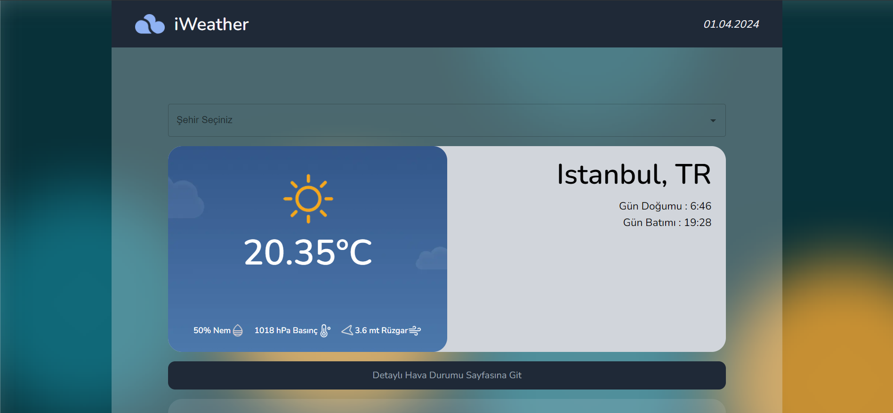
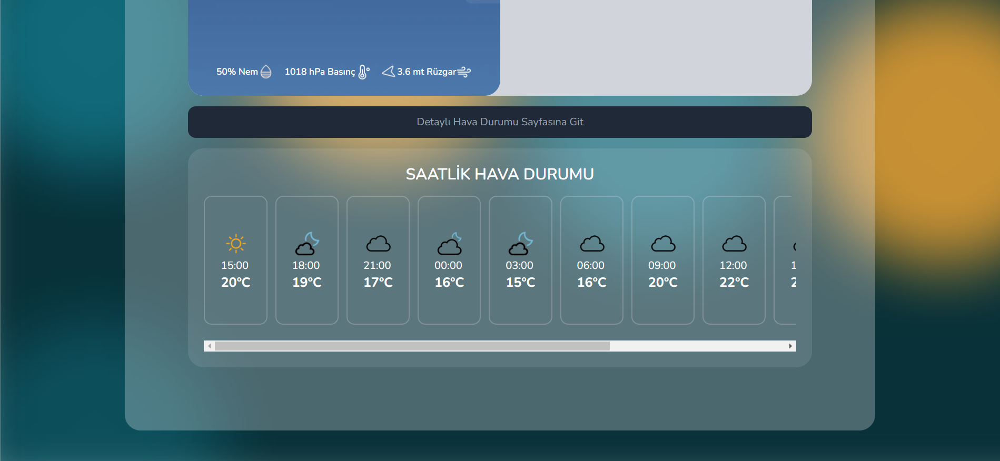
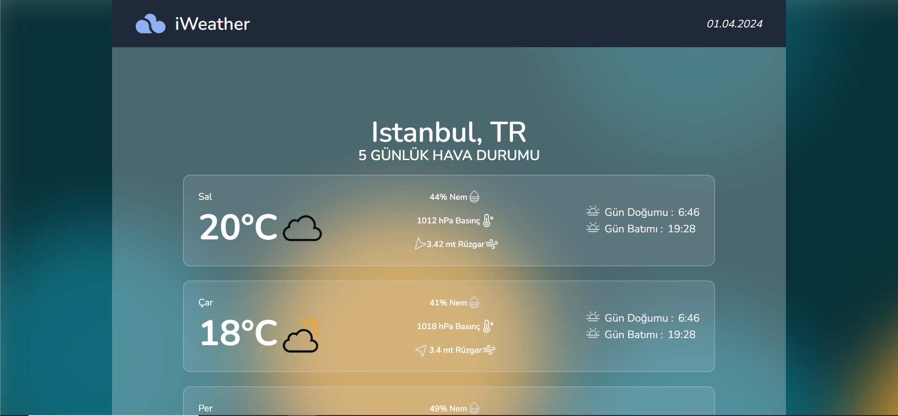

# Weather App

Bu NextJs projesi, hava durumu bilgilerini gösteren bir web uygulamasını içermektedir. Uygulama, https://openweathermap.org/ API'sini kullanarak gerçek zamanlı hava durumu verilerini alır ve kullanıcıya sunar.

## Özellikler

- Konum bazlı hava durumu bilgilerini görüntüleme
- Anlık sıcaklık, nem oranı, rüzgar hızı gibi hava durumu verilerini gösterme
- Saatlik hava durumu bilgilerini görüntüleme
- Günlük hava durumu tahminlerini görüntüleme

## Proje Kurulumu

1. Bu projeyi klonlayın veya indirin.
2. Proje dizinine gidin: `cd weather-app`
3. Gerekli bağımlılıkları yüklemek için `npm install` veya `yarn install` komutunu çalıştırın.
4. Daha sonra `npm run dev` komutu ile projeyi çalıştırın.

## Ekran Görüntüleri

_Ana Sayfa_

_Ana Sayfa_

_Konum Arama_

## Teknolojiler

- React
- NextJs (App Router)
- WeatherApi API
- Axios (HTTP istekleri için)
- Material Ui
- Zustand (Durum yönetimi için)
- Lodash (Fonksiyonel yardımcılar için)

## Katkıda Bulunma

Bu proje her türlü katkıya açıktır. Herhangi bir hata raporu, öneri veya katkıda bulunmak isterseniz, lütfen yeni bir "Issue" açın veya bir "Pull Request" gönderin.

## Lisans

Bu proje MIT Lisansı altında lisanslanmıştır. Daha fazla bilgi için `LICENSE` dosyasını inceleyin.
